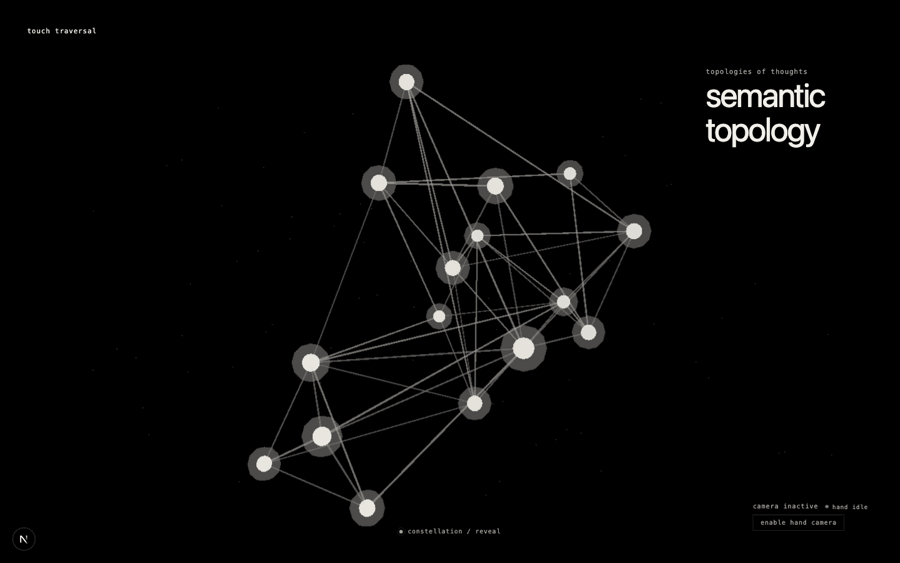
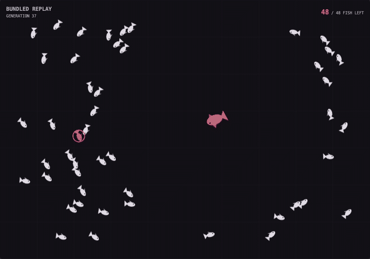

  <picture>
    <source media="(prefers-color-scheme: dark)" srcset="https://raw.githubusercontent.com/SyedBaqarAbbas/SyedBaqarAbbas/generated/hero-dark.svg">
    <source media="(prefers-color-scheme: light)" srcset="https://raw.githubusercontent.com/SyedBaqarAbbas/SyedBaqarAbbas/generated/hero-light.svg">
    
  </picture>

  Usually with data, agents, simulations, or a small idea that became a whole repository.

  
  &nbsp;&nbsp;&nbsp;
  
  &nbsp;&nbsp;&nbsp;
  

## currently losing weekends to

### [touch traversal](https://github.com/SyedBaqarAbbas/touch-traversal)

A local-first knowledge graph that turns Markdown notes into a 3D constellation you can explore with a mouse, keyboard, or hand gestures.

[open the constellation](https://syedbaqarabbas.github.io/touch-traversal/) · [browse the source](https://github.com/SyedBaqarAbbas/touch-traversal)

### [fish survival network](https://github.com/SyedBaqarAbbas/fish-survival-network)

A browser-based neuroevolution simulation where fish evolve neural-network survival strategies against a predator, one generation at a time.

[watch them evolve](https://fish-survival-network.vercel.app/) · [browse the source](https://github.com/SyedBaqarAbbas/fish-survival-network)

### also around here

- [ImageTranslator](https://github.com/SyedBaqarAbbas/ImageTranslator) — raw manga in, translated pages out.
- [IndexInvestmentPlanner](https://github.com/SyedBaqarAbbas/IndexInvestmentPlanner) — a KSE-100 replication and rebalancing calculator.

## tools I reach for

**Core:** Python · SQL 
**Build:** Data engineering · Machine learning · AI agents & automation

<!--
Proof of life is intentionally hidden for now because GitHub already shows a contribution graph below the profile README.

## proof of life

<picture>
  <source media="(prefers-color-scheme: dark)" srcset="https://raw.githubusercontent.com/SyedBaqarAbbas/SyedBaqarAbbas/generated/activity-dark.svg">
  <source media="(prefers-color-scheme: light)" srcset="https://raw.githubusercontent.com/SyedBaqarAbbas/SyedBaqarAbbas/generated/activity-light.svg">
  
</picture>

A rolling year of contributions, commits, pull requests, and reviews, plus recent public releases. Updated daily.
-->

## the weekday version

  
open if you're curious

   

I work in data engineering at Maiden Century. Before that, I was the founding data scientist behind ekai at Rayn, with earlier machine-learning work at Vyro.

I studied Software Engineering at NUST and co-authored a [machine-learning paper on 3D-printed concrete](https://doi.org/10.3390/ma16114149).

## say hi

If something here made you curious, [send me an email](mailto:baqar2001@gmail.com) or find the more polished version of me at [syedbaqarabbas.dev](https://syedbaqarabbas.dev/).

Powered by GitHub Actions and a questionable respect for weekends.
